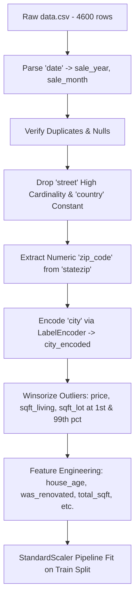
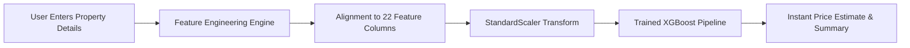

# 🏠 House Price Prediction

An end-to-end Data Analytics and Machine Learning regression project that analyzes residential real-estate transaction data and predicts house prices based on physical, structural, and geographic characteristics. Developed as part of the **AICTE | IBM SkillsBuild Data Analytics with AI Academic Internship 2026**.

---

## 📌 Project Overview

| Detail | Value |
| :--- | :--- |
| **Project** | House Price Prediction Using Machine Learning |
| **Domain** | Data Analytics with AI / Machine Learning |
| **Problem Type** | Supervised Regression |
| **Target Variable** | `price` (USD) |
| **Dataset** | King County, Washington Housing Dataset (`data.csv`, 4,600 records) |
| **Models Evaluated** | Linear Regression, Random Forest Regressor, Gradient Boosting Regressor, XGBoost Regressor |
| **Best Model** | XGBoost Regressor ($R^2 = 0.6213$, $\text{RMSE} = \$202,060$) |
| **User Interface** | Interactive 5-Page Streamlit Web Application |
| **Language** | Python 3.9+ (Tested on Python 3.13) |
| **Internship Program** | AICTE \| IBM SkillsBuild Data Analytics with AI Academic Internship 2026 |

---

## 🎯 Problem Statement

Residential property valuation is influenced by an intricate combination of factors including living area, property condition, room count, architectural layout, and geographic location. Traditional property valuation methods often depend on manual comparables, which can be time-consuming and subjective.

This project uses historical housing transaction records to estimate property sale prices using supervised machine learning regression techniques. By training, tuning, and evaluating multiple baseline and ensemble regression algorithms on historical transaction data, the system models the multi-dimensional relationships between property features and final transaction prices.

> [!NOTE]
> This project is designed as an analytical study and machine learning demonstration for academic evaluation. Predictions represent statistical estimates based on historical transaction patterns and do not replace certified real-estate appraisal reports.

---

## 🎯 Project Objectives

1. **Understand Dataset Architecture:** Conduct exploratory profiling of feature data types, distribution shapes, statistical moments, missing records, and anomalies.
2. **Clean & Preprocess Data:** Implement a reproducible data cleaning pipeline addressing zero-value anomalies, dates, high-cardinality features, categorical encoding, and outlier winsorization.
3. **Exploratory Data Analysis (EDA):** Generate 10 publication-quality visualizations analyzing price distributions, structural correlations, and geographic price drivers.
4. **Engineer Domain Features:** Derive new mathematical and temporal features (`house_age`, `was_renovated`, `renovation_age`, `total_sqft`, `living_to_lot`, `has_basement`, `sale_year`, `sale_month`, `zip_code`, `city_encoded`) to enhance predictive signal.
5. **Train Multiple Regression Models:** Train Linear Regression (baseline), Random Forest Regressor (bagging ensemble), Gradient Boosting Regressor (boosting ensemble), and XGBoost Regressor (regularized gradient boosting).
6. **Evaluate & Compare Models:** Evaluate all algorithms strictly on an unseen 20% test partition using Mean Absolute Error (MAE), Root Mean Squared Error (RMSE), and Coefficient of Determination ($R^2$).
7. **Deploy Interactive Web Application:** Build a 5-page Streamlit web application providing instant price predictions, interactive dashboards, complete EDA galleries, model metric comparisons, and data-driven analytical insights.
8. **Extract Analytical Insights:** Formulate automated, data-driven analytical insights computed directly from dataset calculations.

---

## 📊 Dataset

The project utilizes the King County, Washington housing dataset located in `data/data.csv`.

### Dataset Summary Statistics
* **Total Records:** 4,600 rows
* **Total Features:** 18 columns (17 predictor variables + 1 target variable)
* **Target Variable:** `price`
* **Missing Values:** 0 missing values across all columns
* **Duplicate Records:** 0 true duplicate rows
* **Identified Anomaly:** 49 records recorded with a sale price of `$0.00`, treated during the preprocessing stage via percentile winsorization.
* **Target Summary (Raw):**
  * Minimum: `$0.00`
  * 25th Percentile: `$322,875.00`
  * Median (50th Percentile): `$460,943.50`
  * Mean: `$551,963.00`
  * 75th Percentile: `$654,962.50`
  * Maximum: `$26,590,000.00`
  * Standard Deviation: `$563,834.70`

### Data Dictionary

| Column | Data Type | Description | Role in Pipeline |
| :--- | :--- | :--- | :--- |
| `date` | `object` | Date and time string of the property transaction | Parsed into `sale_year` & `sale_month`; raw column dropped |
| `price` | `float64` | Sale price of the property in USD | **Target Variable** (Winsorized 1%–99%) |
| `bedrooms` | `float64` | Total number of bedrooms (0 to 9) | Numerical Feature |
| `bathrooms` | `float64` | Number of bathrooms (fractions indicate half/three-quarter baths) | Numerical Feature |
| `sqft_living` | `int64` | Interior habitable living space in square feet | Numerical Feature (Winsorized 1%–99%) |
| `sqft_lot` | `int64` | Total land parcel/lot area in square feet | Numerical Feature (Winsorized 1%–99%) |
| `floors` | `float64` | Number of structural levels/floors (1.0 to 3.5) | Numerical Feature |
| `waterfront` | `int64` | Binary flag for waterfront proximity (1 = Waterfront, 0 = Non-waterfront) | Categorical Binary Feature |
| `view` | `int64` | Visual outlook rating (0 to 4 scale) | Ordinal Feature |
| `condition` | `int64` | Overall physical maintenance rating (1 = Poor to 5 = Excellent) | Ordinal Feature |
| `sqft_above` | `int64` | Interior space above ground grade level in square feet | Numerical Feature |
| `sqft_basement` | `int64` | Interior space below ground grade level in square feet | Numerical Feature |
| `yr_built` | `int64` | Original construction year (1900 to 2014) | Numerical Feature |
| `yr_renovated` | `int64` | Year of most recent renovation (0 indicates never renovated) | Numerical Feature |
| `street` | `object` | Full street postal address (4,525 unique values) | Dropped (Extreme cardinality, prevents generalization) |
| `city` | `object` | Municipal city name (44 unique cities) | Encoded into integer categories via `LabelEncoder` |
| `statezip` | `object` | State abbreviation and 5-digit postal code (e.g., "WA 98133") | Numerical ZIP extracted via regex; raw column dropped |
| `country` | `object` | Country name ("USA" across all records) | Dropped (Zero variance / constant feature) |

---

## 🧹 Data Cleaning & Preprocessing

The preprocessing pipeline is implemented in `src/data_cleaning.py` through the function `load_and_clean()`. Every transformation is designed to prevent data leakage and ensure numeric readiness for scikit-learn and XGBoost algorithms.



### 1. Date Parsing & Temporal Feature Extraction
* **Implementation:** `pd.to_datetime(df['date'])` parses the timestamp string. `sale_year` and `sale_month` are extracted as discrete numerical fields, and the raw `date` column is dropped.
* **Rationale:** Raw timestamps cannot be ingested directly into linear or tree-based regressors. Extracting year and month captures macroeconomic cycles and seasonal market variations.

### 2. Duplicate Row Removal
* **Implementation:** `df.drop_duplicates(inplace=True)`.
* **Rationale:** Eliminates repeated observations that could bias parameter estimation or cross-split evaluation.

### 3. Missing Value Safeguards
* **Implementation:** Automated imputation using column median for numerical features and mode for categorical features.
* **Rationale:** Although the raw dataset currently has 0 null values, this defensive programming ensures the inference pipeline survives incoming data with partial records.

### 4. Dropping Uninformative & High-Cardinality Columns
* **Implementation:** `df.drop(columns=['street', 'country'])`.
* **Rationale:** `street` contains 4,525 distinct text strings out of 4,600 rows. Including it creates extreme dimensional sparsity and causes severe overfitting. `country` has exactly 1 unique value ("USA") across all rows; zero variance provides zero predictive utility.

### 5. Postal Code Extraction
* **Implementation:** Regular expression `r"(\d+)"` extracts the 5-digit numerical postal code from `statezip` into `zip_code`. The text column `statezip` is dropped.
* **Rationale:** Strips redundant state strings ("WA") and standardizes postal codes as numeric geographic signals.

### 6. Categorical Encoding of Cities
* **Implementation:** `LabelEncoder` transforms the 44 distinct city names into integer codes (`city_encoded`).
* **Rationale:** Translates categorical municipality identities into numeric indices suitable for decision tree splits and regression operations.

### 7. Outlier Winsorization (1st & 99th Percentile Capping)
* **Implementation:** Values in `price`, `sqft_living`, and `sqft_lot` outside the 1st and 99th percentiles are capped using `.clip(lower=lo, upper=hi)`.
* **Rationale:**
  * **Price:** Resolves the 49 anomalous records with `price = $0.00` by capping them at the 1st percentile ($175,000) and clips multi-million dollar luxury extremes ($26.59M capped at $1.96M).
  * **Living Area & Lot:** Prevents extreme square-footage outliers from exerting outsized leverage during loss minimization in Ordinary Least Squares and gradient boosting.

### 8. Train/Test Partition & Feature Scaling
* **Implementation:** 80% training set (3,680 samples) and 20% testing set (920 samples) split with `random_state=42`. `StandardScaler()` is integrated into a Scikit-Learn `Pipeline`.
* **Rationale:** Fitting the scaler strictly on `X_train` and applying the learned transformation to `X_test` guarantees zero data leakage from test distributions into model training.

---

## 📈 Exploratory Data Analysis (EDA)

Exploratory Data Analysis is automated in `src/eda.py` and produces 10 high-resolution visualizations stored in the `visualizations/` directory:

| Visualization File | Chart Type | Analytical Purpose & Observed Insight |
| :--- | :--- | :--- |
| `01_price_distribution.png` | Dual Subplot Histograms | Evaluates raw price distribution vs log-transformed price. Confirms extreme right-skewness in raw housing prices and near-normal Bell curve upon log transformation. |
| `02_price_vs_sqft.png` | Scatter Plot | Assesses relationship between living space (`sqft_living`) and price. Shows strong positive linear correlation ($r = 0.662$ on cleaned data). |
| `03_price_vs_bedrooms.png` | Box Plot | Compares price distribution across bedroom counts (0 to 9). Demonstrates median prices rise steadily from 1 to 5 bedrooms before plateauing. |
| `04_price_vs_bathrooms.png` | Box Plot | Evaluates price scaling with bathroom count (0.75 to 8.0). Shows progressive upward price trend with higher bathroom availability ($r = 0.510$). |
| `05_price_vs_condition.png` | Bar Chart | Compares median house prices across condition ratings (1=Poor to 5=Excellent). Confirms higher maintenance rating commands higher valuation. |
| `06_price_vs_waterfront.png` | Box Plot | Direct comparison between Waterfront vs Non-Waterfront properties. Uncovers a ~166% average price premium for waterfront homes. |
| `07_price_vs_floors.png` | Bar Chart | Compares median price by number of floors (1.0 to 3.5). 2.5-story and 3.0-story homes exhibit the highest median market prices. |
| `08_price_vs_yr_built.png` | Line Plot with Fill | Traces median price across construction years (1900–2014). Demonstrates vintage pre-1940s homes and modern post-2000s builds command higher prices than mid-century properties. |
| `09_correlation_heatmap.png` | Masked Correlation Heatmap | Pearson correlation matrix across all numeric features. Shows `total_sqft` (0.66), `sqft_living` (0.66), and `sqft_above` (0.58) as strongest positive correlates. |
| `10_top_cities_by_price.png` | Horizontal Bar Chart | Displays top 20 cities ranked by median house price. Highlights Medina, Clyde Hill, Yarrow Point, and Mercer Island as peak high-value markets. |

---

## ⚙️ Feature Engineering

Feature engineering is executed within `src/data_cleaning.py`. Ten domain-specific features are engineered to enrich structural, temporal, and spatial relationships:

| Engineered Feature | Mathematical Formula / Logic | Analytical Purpose |
| :--- | :--- | :--- |
| `house_age` | `sale_year - yr_built` (clipped at $\ge 0$) | Measures building age at the time of transaction; captures age-related depreciation or vintage value better than calendar year. |
| `was_renovated` | `1 if yr_renovated > 0 else 0` | Binary indicator isolating renovated properties from original structures. |
| `renovation_age` | `(sale_year - yr_renovated) if yr_renovated > 0 else 0` | Quantifies years since modernization, distinguishing recent renovations from distant ones. |
| `total_sqft` | `sqft_above + sqft_basement` | Aggregates all above-grade and subterranean interior living area into a unified size metric. |
| `living_to_lot` | `sqft_living / (sqft_lot + 1)` | Ratio measuring density of structural footprint relative to total land parcel area. |
| `has_basement` | `1 if sqft_basement > 0 else 0` | Binary structural indicator separating single-grade slab/crawlspace houses from basement homes. |
| `sale_year` | `pd.to_datetime(date).dt.year` | Captures macroeconomic market trends during the transaction year. |
| `sale_month` | `pd.to_datetime(date).dt.month` | Captures seasonal fluctuations (e.g., peak spring/summer housing demand). |
| `zip_code` | Regex `(\d+)` from `statezip` | Provides numerical regional postal grouping for neighborhood-level price estimation. |
| `city_encoded` | `LabelEncoder().fit_transform(city)` | Converts 44 discrete municipal designations into numerical categories. |

*Total predictor features used in model training: 22 (stored in `models/feature_columns.json`).*

---

## 🤖 Machine Learning Modeling

Four regression algorithms were trained using Scikit-Learn pipelines that combine `StandardScaler` with the respective estimator:

### 1. Linear Regression (Baseline Model)
* **Architecture:** Ordinary Least Squares (OLS) parametric linear regression.
* **Pipeline Configuration:** `Pipeline([('scaler', StandardScaler()), ('model', LinearRegression())])`
* **Role:** Establishes the foundational linear baseline against which ensemble gains are measured. Assumes linear relationships and homoscedastic residual distributions.

### 2. Random Forest Regressor (Bagging Ensemble)
* **Architecture:** Bootstrap aggregation of 200 de-correlated decision trees.
* **Configured Hyperparameters:**
  * `n_estimators`: 200
  * `max_depth`: 20
  * `min_samples_leaf`: 2
  * `random_state`: 42
  * `n_jobs`: -1
* **Role:** Non-linear ensemble that reduces model variance by averaging across randomized subsets of features and samples.

### 3. Gradient Boosting Regressor (Boosting Ensemble)
* **Architecture:** Forward stage-wise additive boosting ensemble.
* **Configured Hyperparameters:**
  * `n_estimators`: 300
  * `learning_rate`: 0.08
  * `max_depth`: 5
  * `subsample`: 0.8
  * `random_state`: 42
* **Role:** Iteratively minimizes squared error loss by fitting each subsequent tree to the pseudo-residuals of preceding trees.

### 4. XGBoost Regressor (Regularized Gradient Boosting)
* **Architecture:** eXtreme Gradient Boosting utilizing second-order Taylor expansion loss approximations and tree-level regularization.
* **Configured Hyperparameters:**
  * `n_estimators`: 400
  * `learning_rate`: 0.07
  * `max_depth`: 6
  * `subsample`: 0.8
  * `colsample_bytree`: 0.8
  * `eval_metric`: `"rmse"`
  * `random_state`: 42
* **Role:** State-of-the-art gradient boosted trees incorporating column subsampling and depth constraints to minimize variance and overfitting.

### Train/Test Split Protocol
* **Training Partition:** 80% (3,680 records)
* **Testing Partition:** 20% (920 records)
* **Random Seed:** `42`
* **Evaluation Scope:** All evaluation metrics are calculated exclusively on the held-out 20% test partition (`X_test`, `y_test`).

---

## 📊 Model Evaluation

The performance of each trained model was evaluated on the unseen test set (920 samples). The table below reflects the **actual metrics generated by the project pipeline** (recorded in `models/eval_results.json`):

| Model Name | Mean Absolute Error (MAE) | Mean Squared Error (MSE) | Root Mean Squared Error (RMSE) | $R^2$ Score |
| :--- | :---: | :---: | :---: | :---: |
| **XGBoost Regressor** | **$105,383** | **40,828,397,216** | **$202,060** | **0.6213** |
| **Gradient Boosting Regressor** | $108,035 | 41,752,127,526 | $204,333 | 0.6127 |
| **Random Forest Regressor** | $123,364 | 47,378,407,621 | $217,666 | 0.5606 |
| **Linear Regression** | $158,504 | 57,165,601,934 | $239,093 | 0.4698 |

### Technical Metric Definitions

* **Mean Absolute Error (MAE):**
  $$\text{MAE} = \frac{1}{n} \sum_{i=1}^{n} |y_i - \hat{y}_i|$$
  Measures the average magnitude of prediction errors in dollar terms. An MAE of $105,383 indicates that on average, XGBoost predictions deviate from actual sale prices by approximately $105,383.

* **Root Mean Squared Error (RMSE):**
  $$\text{RMSE} = \sqrt{\frac{1}{n} \sum_{i=1}^{n} (y_i - \hat{y}_i)^2}$$
  Penalizes larger outliers more heavily due to the squaring operation. XGBoost achieved the lowest RMSE ($202,060), proving superior resilience against large prediction errors compared to Linear Regression ($239,093).

* **Coefficient of Determination ($R^2$):**
  $$R^2 = 1 - \frac{\sum_{i=1}^{n} (y_i - \hat{y}_i)^2}{\sum_{i=1}^{n} (y_i - \bar{y})^2}$$
  Quantifies the proportion of variance in house prices explained by the model's predictors. XGBoost explains **62.13%** of the variance in unseen test prices, outperforming the baseline Linear Regression model (46.98%) by **+15.15 percentage points**.

---

## 🏆 Best Model / Final Results

In accordance with the pipeline's automated selection logic (`best = max(results, key=lambda r: r['R2'])`), the top-performing model is:

* **Selected Model:** **XGBoost Regressor**
* **Test $R^2$ Score:** **0.6213**
* **Test MAE:** **$105,383**
* **Test RMSE:** **$202,060**
* **Model Serialization Path:** `models/best_model.pkl`

### Why XGBoost Won
1. **Non-Linear Interaction Modeling:** Housing prices depend on non-linear interaction terms (e.g., high square footage adds substantially more value in Medina or Bellevue than in distant suburbs). Tree boosting natively segments these compound conditions.
2. **Regularization Mechanisms:** XGBoost applies shrinkage (`learning_rate=0.07`), row subsampling (`subsample=0.8`), and column subsampling (`colsample_bytree=0.8`), mitigating overfitting to training noise.
3. **Iterative Error Correction:** Unlike Random Forest, which builds independent trees in parallel, XGBoost constructs trees sequentially to correct the residual errors of earlier iterations.

### Generated Evaluation Visualizations
The model training script (`src/model_training.py`) automatically generated 4 diagnostic plots in `visualizations/`:
* `11_model_comparison.png` — Side-by-side horizontal bar charts comparing test $R^2$ and RMSE across all 4 models.
* `12_actual_vs_predicted.png` — Scatter plot of actual vs predicted prices showing alignment along the ideal 45-degree reference line ($R^2 = 0.6213$).
* `13_residuals.png` — Residual diagnostic plots displaying residuals vs fitted values and the residual error distribution histogram.
* `14_feature_importance.png` — Horizontal bar chart displaying the top 15 features ranked by importance score.

### Top Feature Importances (from `models/feature_importance.json`)
1. `total_sqft`: **27.54%**
2. `sqft_living`: **13.92%**
3. `has_basement`: **12.49%**
4. `view`: **6.19%**
5. `city_encoded`: **5.39%**
6. `zip_code`: **4.97%**
7. `waterfront`: **3.94%**
8. `house_age`: **3.37%**
9. `sqft_above`: **2.67%**
10. `yr_built`: **2.63%**

---

## 🌐 Streamlit Web Application

The interactive web application is implemented in `app/streamlit_app.py` and provides a 5-page dashboard for real-time inference and analytical exploration.



### Application Pages & Features

1. **🏡 Predict Price:**
   * User inputs property specifications through organized forms:
     * *Rooms & Size:* Bedrooms (0–20), Bathrooms (0–10), Floors (1–4), Living Area (sqft), Lot Size (sqft).
     * *Structure Details:* Above-ground sqft, Basement sqft, Year Built, Year Renovated, Condition rating slider (1–5).
     * *Features & Location:* Waterfront toggle, View rating slider (0–4), City selector (from 44 dataset cities), Sale Year, Sale Month.
   * On clicking **Predict Price**, the application executes real-time feature engineering, feeds the aligned vector into `models/best_model.pkl`, and renders the formatted price estimate along with an input summary dashboard.

2. **📊 Dashboard:**
   * High-level KPI cards displaying Total Records (4,600), Features Used (22), Average Price ($551,963), Max Price ($26.59M), and Min Price ($0.00).
   * Interactive tabular views for dataset preview, descriptive statistics, and model comparison metrics.

3. **🔬 EDA Charts:**
   * Interactive expandable gallery displaying all 14 project visualizations (10 EDA charts + 4 model performance evaluations).

4. **🤖 Model Comparison:**
   * Visual metric cards displaying test $R^2$, MAE, and RMSE for Linear Regression, Random Forest, Gradient Boosting, and XGBoost.
   * Interactive inspection of evaluation plots and full tabular display of feature importance weights.

5. **🧠 AI Insights:**
   * Displays 8 analytical findings computed directly from the dataset, paired with a live correlation ranking table showing the correlation of each feature with property price.

---

## 🧠 AI/Data Analytics Insights

All insights are derived from mathematical computations performed on `data/data.csv`:

1. **Living Area Dominates Valuation:** `sqft_living` exhibits a Pearson correlation of **0.662** on clean data (and `total_sqft` at **0.664**), making total habitable space the primary driver of property value.
2. **Waterfront Value Premium:** Waterfront properties average **$1,451,621** compared to **$545,462** for non-waterfront properties, representing a computed **166.1% premium**.
3. **Substantial Municipal Price Divergence:** Average house prices vary by nearly 10x across cities: **Medina** ranks highest with an average price of **$2,046,559**, while **Algona** averages **$207,288**.
4. **Physical Maintenance Impact:** Properties rated in Condition 5 (Excellent) command higher median market valuations than those in Condition 1 (Poor), demonstrating measurable return on property maintenance.
5. **Bathrooms Outperform Bedrooms as a Quality Signal:** Bathroom count ($r = 0.510$) correlates more strongly with house price than bedroom count ($r = 0.328$). Larger modern homes prioritize bathroom-to-bedroom ratios.
6. **Non-Linear Age Trajectory:** Vintage homes (built before 1940) and modern constructions (built after 2000) command higher median prices than mid-century structures (1960–1980), illustrating non-linear architectural demand.

---

## 📁 Project Structure

```text
House-Price-Prediction-IBM-SkillsBuild/
├── .gitignore                      # Git exclusion rules (__pycache__, IDE configs)
├── README.md                       # Comprehensive project documentation
├── requirements.txt                # Exact Python library dependencies
├── main.py                         # Master pipeline entry point
├── app/
│   └── streamlit_app.py            # 5-page interactive Streamlit web application
├── data/
│   └── data.csv                    # King County housing dataset (4,600 records)
├── models/
│   ├── best_model.pkl              # Serialized XGBoost regression pipeline artifact
│   ├── eval_results.json           # Evaluation metrics for all 4 trained models
│   ├── feature_columns.json        # 22-feature column ordering schema
│   └── feature_importance.json     # Feature importance weights from the best model
├── notebooks/
│   └── .gitkeep                    # Directory placeholder for experimental notebooks
├── src/
│   ├── data_understanding.py       # Step 1: Statistical inspection and profiling
│   ├── data_cleaning.py            # Steps 2 & 4: Cleaning & feature engineering pipeline
│   ├── eda.py                      # Step 3: 10 publication-quality EDA visualizations
│   └── model_training.py           # Steps 5 & 6: Training, evaluation & plot generation
└── visualizations/                 # 14 generated project chart artifacts
    ├── 01_price_distribution.png
    ├── 02_price_vs_sqft.png
    ├── 03_price_vs_bedrooms.png
    ├── 04_price_vs_bathrooms.png
    ├── 05_price_vs_condition.png
    ├── 06_price_vs_waterfront.png
    ├── 07_price_vs_floors.png
    ├── 08_price_vs_yr_built.png
    ├── 09_correlation_heatmap.png
    ├── 10_top_cities_by_price.png
    ├── 11_model_comparison.png
    ├── 12_actual_vs_predicted.png
    ├── 13_residuals.png
    └── 14_feature_importance.png
```

---

## 🚀 Installation & Setup

### Prerequisites
* Python 3.9, 3.10, 3.11, 3.12, or 3.13 installed.
* Git installed on your system.

### Step 1: Clone the Repository
```bash
git clone https://github.com/mahammedsathyala/House-Price-Prediction-IBM-SkillsBuild.git
cd House-Price-Prediction-IBM-SkillsBuild
```

### Step 2: Set Up Virtual Environment (Recommended)
```bash
# Windows
python -m venv venv
.\venv\Scripts\activate

# macOS / Linux
python3 -m venv venv
source venv/bin/activate
```

### Step 3: Install Required Dependencies
```bash
pip install -r requirements.txt
```

---

## ▶️ How to Run the Project

### Option A: Execute the Complete End-to-End Pipeline
To inspect the dataset, clean the data, engineer features, generate all 14 visualizations, train all 4 models, and save artifacts:

```bash
python main.py
```

*What `main.py` performs:*
1. Runs data understanding and prints a terminal profiling report.
2. Cleans raw data and generates 10 engineered features.
3. Generates and saves 10 EDA charts to `visualizations/`.
4. Trains Linear Regression, Random Forest, Gradient Boosting, and XGBoost on an 80/20 split.
5. Saves the winning pipeline to `models/best_model.pkl` and records metrics in `models/eval_results.json`.
6. Generates 4 diagnostic model evaluation plots in `visualizations/`.

### Option B: Launch the Interactive Web Application
```bash
streamlit run app/streamlit_app.py
```

*Once launched, navigate to `http://localhost:8501` in your web browser to access the 5-page dashboard.*

---

## 💡 Key Findings

* **Interior Space is the Primary Determinant:** `total_sqft` ($r = 0.664$) and `sqft_living` ($r = 0.662$) account for the single largest share of price variation and represent over 41% of feature importance in the best model.
* **Extreme Waterfront Premium:** Waterfront homes trade at an average of $1.45M compared to $545K for inland homes (a computed +166.1% premium).
* **Location Drives Variance:** Median house prices vary significantly by city, led by prestigious enclaves like Medina, Clyde Hill, and Mercer Island.
* **Tree Ensembles Outperform Linear Baselines:** Non-linear tree ensembles (XGBoost $R^2 = 0.6213$, Gradient Boosting $R^2 = 0.6127$) substantially outperform Linear Regression ($R^2 = 0.4698$), demonstrating that real estate pricing relationships are non-linear.
* **Bathrooms Carry More Signal Than Bedrooms:** Bathroom count correlates more strongly with final transaction price ($r = 0.510$) than bedroom count ($r = 0.328$).

---

## 🛠️ Technology Stack

| Technology | Category | Purpose in Project |
| :--- | :--- | :--- |
| **Python** | Programming Language | Core execution language (Python 3.9+) |
| **Pandas** | Data Manipulation | Dataframe operations, data cleaning, datetime extraction |
| **NumPy** | Numerical Computing | Matrix transformations, percentile clipping, log calculations |
| **Matplotlib** | Data Visualization | Generating base distribution plots, scatter charts, and residual figures |
| **Seaborn** | Statistical Visualization | Aesthetic styling, correlation heatmaps, and categorical box plots |
| **Scikit-learn** | Machine Learning | Pipelines, `StandardScaler`, `LabelEncoder`, train/test split, Linear Regression, Random Forest, Gradient Boosting, evaluation metrics |
| **XGBoost** | Gradient Boosting | Regularized gradient boosted tree modeling (`XGBRegressor`) |
| **Joblib** | Model Persistence | Serializing and loading the trained model pipeline (`.pkl`) |
| **Streamlit** | Web Framework | 5-page interactive web application and user interface |
| **Git & GitHub** | Version Control | Source code versioning and collaborative repository management |

---

## ⚠️ Limitations

1. **Temporal & Geographic Specificity:** Dataset reflects 2014 residential transactions in King County, Washington. It does not reflect subsequent inflation or economic cycles, nor does it generalize directly to other metropolitan areas.
2. **Absence of Hyperlocal & Macroeconomic Covariates:** External drivers such as mortgage rates, municipal tax rates, proximity to transit hubs, school ratings, and neighborhood crime statistics were not present in the dataset.
3. **Absence of Visual Quality Data:** Real estate valuations are significantly affected by interior finishes, aesthetic style, and structural wear, which tabular attributes alone cannot fully capture.
4. **Partition Sensitivity:** Evaluation is conducted on a fixed 80/20 train/test split. While stratified-like random state splitting was used, K-Fold cross-validation provides broader statistical stability.
5. **Estimation Scope:** The model produces statistical estimates intended for analytical and academic demonstrations; it does not constitute an official appraisal.

---

## 🔮 Future Scope

1. **K-Fold Cross-Validation:** Implement 5-fold or 10-fold cross-validation across all models to ensure performance metric stability across arbitrary data partitions.
2. **Automated Hyperparameter Optimization:** Implement Bayesian optimization (e.g., Optuna) or extensive Grid Search to tune tree depth, learning rate, and regularizations.
3. **Geospatial Feature Engineering:** Incorporate precise latitude/longitude coordinates to compute Euclidean distance to major employment hubs (e.g., downtown Seattle, Bellevue tech corridors).
4. **Model Explainability with SHAP / LIME:** Integrate SHAP (SHapley Additive exPlanations) values in the Streamlit application to explain individual house price predictions to end users.
5. **Cloud Deployment:** Deploy the Streamlit application to Streamlit Community Cloud or AWS EC2 with continuous integration (CI) workflows.
6. **Integration of Multimodal Features:** Combine structured tabular features with property photography using Computer Vision (CNNs) to evaluate interior condition and architectural appeal.

---

## 👨‍💻 Author

**Sathyala Mahammed**  
* **Degree:** B.Tech in Electronics and Communication Engineering (ECE)  
* **Institution:** Bhimavaram Institute of Engineering and Technology (BIET), JNTUK  
* **Internship:** AICTE | IBM SkillsBuild Data Analytics with AI Academic Internship 2026  
* **GitHub:** [@mahammedsathyala](https://github.com/mahammedsathyala)  
* **Repository:** [House-Price-Prediction-IBM-SkillsBuild](https://github.com/mahammedsathyala/House-Price-Prediction-IBM-SkillsBuild)

---

## 📚 References

1. King County Department of Assessments — Housing Data Records.
2. Pedregosa et al., *Scikit-learn: Machine Learning in Python*, JMLR 12, pp. 2825-2830, 2011.
3. Chen, T., & Guestrin, C., *XGBoost: A Scalable Tree Boosting System*, KDD '16, 2016.
4. Streamlit Documentation: [https://docs.streamlit.io/](https://docs.streamlit.io/)
5. AICTE & IBM SkillsBuild Data Analytics with AI Program Curriculum (2026).
